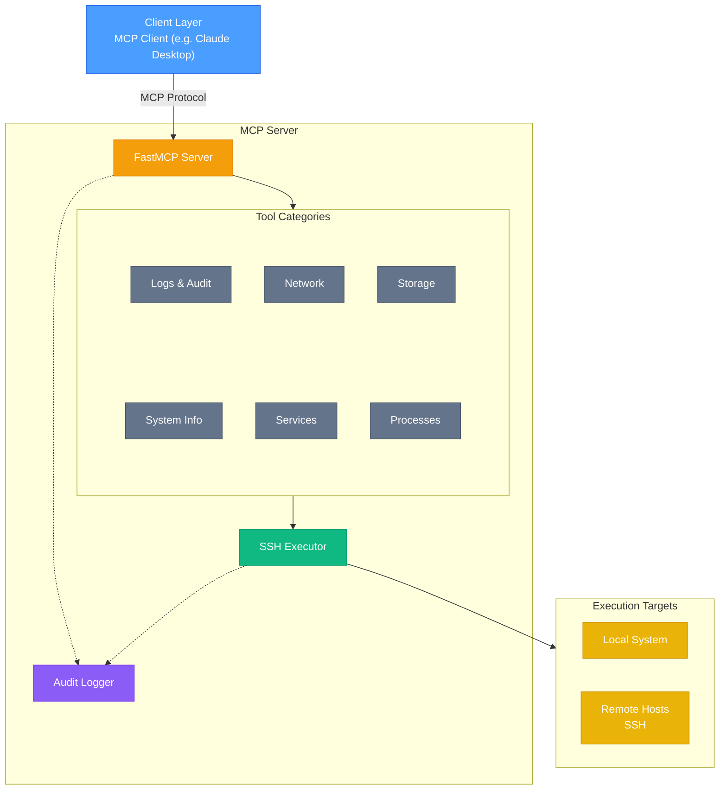

[](https://github.com/rhel-lightspeed/linux-mcp-server/actions/workflows/ci.yml)
[](https://codecov.io/gh/rhel-lightspeed/linux-mcp-server)


# Linux MCP Server

A Model Context Protocol (MCP) server for read-only Linux system administration, diagnostics, and troubleshooting on RHEL-based systems.


## Features

- **Read-Only Operations**: All tools are strictly read-only for safe diagnostics
- **Remote SSH Execution**: Execute commands on remote systems via SSH with key-based authentication
- **Multi-Host Management**: Connect to different remote hosts in the same session
- **Comprehensive Diagnostics**: System info, services, processes, logs, network, and storage
- **Configurable Log Access**: Control which log files can be accessed via environment variables
- **RHEL/systemd Focused**: Optimized for Red Hat Enterprise Linux systems


## Installation

Python 3.10 or later is required.

### Install with `pip`

Create and activate a virtual environment, then install using `pip`:
```bash
pip install linux-mcp-server
```

Or install in the Python user directory
```bash
pip install --user linux-mcp-server
```

### Install with `uv`

Install using `uv`
```bash
uv tool install linux-mcp-server
```

See the [complete installation guide](docs/Install.md) for more details.

## Running from a container

A container runtime such as [Podman] or [Docker] is required.

Since the MCP server uses SSH to connect to remote hosts, SSH keys need to be available inside the container. If the SSH key is encrypted, a passphrase needs to be provided to decrypt the key.


## Configuration

Key environment variables:
- `LINUX_MCP_ALLOWED_LOG_PATHS` - Comma-separated list of log files that can be accessed
- `LINUX_MCP_LOG_LEVEL` - Logging level (DEBUG, INFO, WARNING, ERROR, CRITICAL)
- `LINUX_MCP_SSH_KEY_PATH` - Path to SSH private key for remote execution
- `LINUX_MCP_USER` - Username used for SSH connections

See [Environment Variables](docs/Install.md#environment-variables) for more details.

### Example Configurations

For the following example configurations, make sure to provide real paths to SSH key and log files.

If `ssh-agent` is configured, any keys loaded into the session will be used automatically when running natively.

<details>
  <summary>Claude Desktop Configuration using a container</summary>

```shell
{
  "mcpServers": {
    "Linux Tools": {
      "command": "podman",
      "args": [
        "run",
        "--rm",
        "--interactive",
        "--userns", "keep-id:uid=1001,gid=0",
        "-e", "LINUX_MCP_KEY_PASSPHRASE",
        "-e", "LINUX_MCP_USER",
        "-v", "/home/tljones/.ssh/id_ed25519:/var/lib/mcp/.ssh/id_ed25519:ro,Z",
        "-v", "/home/tljones/.local/share/linux-mcp-server/logs:/var/lib/mcp/.local/share/linux-mcp-server/logs:rw,Z",
        "quay.io/redhat-services-prod/rhel-lightspeed-tenant/linux-mcp-server:latest"
      ],
      "env": {
        "LINUX_MCP_KEY_PASSPHRASE": "<secret>",
        "LINUX_MCP_USER": "tljones"
      }
    }
  }
}

```
</details>

<details>
  <summary>Claude Desktop Configuration running natively</summary>

```shell
{
  "mcpServers": {
    "Linux Tools": {
      "command": "[venv]/bin/linux-mcp-server",
    }
  }
}
```
</details>

<details>
  <summary>Goose configuration using a container</summary>

```shell
extensions:
  linux-tools:
  enabled: true
  type: stdio
  name: linux-tools
  description: Linux tools
  cmd: podman
  args:
    - run
    - --rm
    - --interactive
    --userns,
    "keep-id:uid=1001,gid=0",
    - -e
    - LINUX_MCP_KEY_PASSPHRASE
    - -e
    - LINUX_MCP_USER
    - -v
    - /home/tljones/.ssh/id_ed25519:/var/lib/mcp/.ssh/id_ed25519:ro
    - -v
    - /home/tljones/.local/share/linux-mcp-server/logs:/var/lib/mcp/.local/share/linux-mcp-server/logs:rw
    - quay.io/redhat-services-prod/rhel-lightspeed-tenant/linux-mcp-server:latest
  envs: {}
  env_keys:
    - LINUX_MCP_KEY_PASSPHRASE
    - LINUX_MCP_USER
  timeout: 30
  bundled: null
  available_tools: []
```
</details>

<details>
  <summary>Goose configuration running natively</summary>

```shell
extensions:
  linux-tools:
  enabled: true
  type: stdio
  name: linux-tools
  description: Linux tools
  cmd: [venv]/bin/linux-mcp-server
  envs: {}
  env_keys:
    - LINUX_MCP_KEY_PASSPHRASE
    - LINUX_MCP_USER
  timeout: 30
  bundled: null
  available_tools: []
```
</details>

## Audit Logging

All server operations are logged in both human-readable and JSON formats with automatic daily rotation and configurable retention. Logs are stored in `~/.local/share/linux-mcp-server/logs/`.


## Tool execution

All tools support optional `host` and `username` parameters for remote execution via SSH:

- **Authentication**: SSH key-based authentication only (no password support)
- **Key Discovery**: Automatically discovers SSH keys from `~/.ssh/` or use `LINUX_MCP_SSH_KEY_PATH`
- **Connection Pooling**: Reuses SSH connections for efficiency
- **Multi-Host**: Each tool call can target a different remote host

**Requirements**:
- SSH key-based authentication must be configured on remote hosts
- Remote user must have appropriate permissions for diagnostic commands


## Usage

### Running the Server

#### Installed using `pip`

Run from within the virtual environment:
```bash
[path to virtual environment]/bin/linux-mcp-server
```

Or run from the Python user directory:
```bash
~/.local/bin/linux-mcp-server
```

#### Installed using `uv`

```bash
uv tool run linux-mcp-server
```

For detailed usage instructions, available tools, and example troubleshooting sessions, see [Usage](docs/Usage.md).

### Using with Claude Desktop

For complete Claude Desktop integration instructions including platform-specific config file locations and alternative configurations, see [Claude Desktop Integration](docs/Install.md#claude-desktop-integration).


## Available Tools

### System Information
- `get_system_information` - OS version, kernel, hostname, uptime
- `get_cpu_information` - CPU details and load averages
- `get_memory_information` - RAM usage and swap details
- `get_disk_usage` - Filesystem usage and mount points
- `get_hardware_information` - Hardware details (CPU architecture, PCI/USB devices, memory hardware)

### Service Management
- `list_services` - List all systemd services with status
- `get_service_status` - Detailed status of a specific service
- `get_service_logs` - Recent logs for a specific service

### Process Management
- `list_processes` - Running processes with CPU/memory usage
- `get_process_info` - Detailed information about a specific process

### Logs & Audit
- `get_journal_logs` - Query systemd journal with filters
- `get_audit_logs` - Read audit logs (if available)
- `read_log_file` - Read specific log file (whitelist-controlled)

### Network Diagnostics
- `get_network_interfaces` - Network interface information
- `get_network_connections` - Active network connections
- `get_listening_ports` - Ports listening on the system

### Storage & Disk Analysis
- `list_block_devices` - Block devices and partitions
- `list_directories_by_size` - List directories sorted by size (largest first) with top N limit
- `list_directories_by_name` - List all directories sorted alphabetically (A-Z or Z-A)
- `list_directories_by_modified_date` - List all directories sorted by modification date (newest/oldest first)


## Architecture Overview



### Key Components

- **FastMCP Server**: Core MCP protocol server handling tool registration and invocation
- **Tool Categories**: Six categories of read-only diagnostic tools (system info, services, processes, logs, network, storage)
- **SSH Executor**: Routes commands to local subprocess or remote SSH execution with connection pooling
- **Audit Logger**: Comprehensive logging in both human-readable and JSON formats with automatic rotation
- **Multi-Target Execution**: Single server instance can execute commands on local system or multiple remote hosts


[Podman]: https://podman-desktop.io
[Docker]: https://www.docker.com
