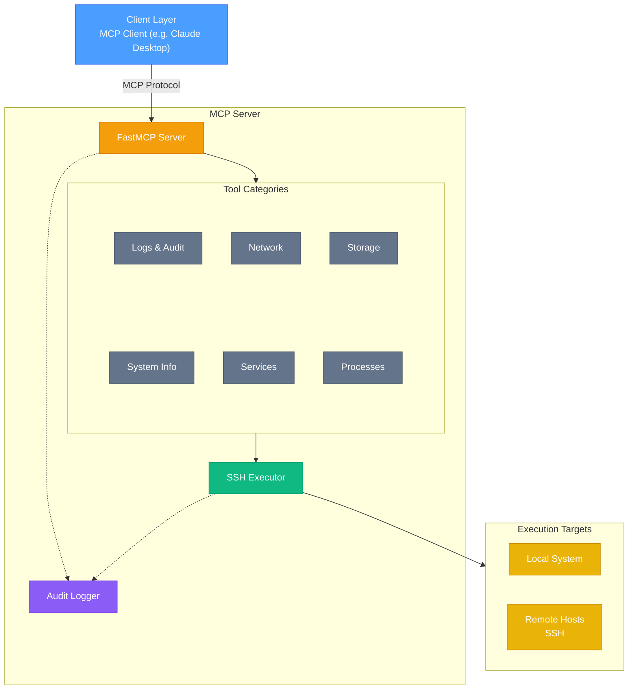

[](https://github.com/rhel-lightspeed/linux-mcp-server/actions/workflows/ci.yml)
[](https://codecov.io/gh/rhel-lightspeed/linux-mcp-server)


# Linux MCP Server

A Model Context Protocol (MCP) server for read-only Linux system administration, diagnostics, and troubleshooting on RHEL-based systems.

## Features

- **Read-Only Operations**: All tools are strictly read-only for safe diagnostics
- **Remote SSH Execution**: Execute commands on remote systems via SSH with key-based authentication
- **Multi-Host Management**: Connect to different remote hosts in the same session
- **Comprehensive Diagnostics**: System info, services, processes, logs, network, and storage
- **Configurable Log Access**: Control which log files can be accessed via environment variables
- **RHEL/systemd Focused**: Optimized for Red Hat Enterprise Linux systems

## Architecture Overview



### Key Components

- **FastMCP Server**: Core MCP protocol server handling tool registration and invocation
- **Tool Categories**: Six categories of read-only diagnostic tools (system info, services, processes, logs, network, storage)
- **SSH Executor**: Routes commands to local subprocess or remote SSH execution with connection pooling
- **Audit Logger**: Comprehensive logging in both human-readable and JSON formats with automatic rotation
- **Multi-Target Execution**: Single server instance can execute commands on local system or multiple remote hosts

## Available Tools

### System Information
- `get_system_info` - OS version, kernel, hostname, uptime
- `get_cpu_info` - CPU details and load averages
- `get_memory_info` - RAM usage and swap details
- `get_disk_usage` - Filesystem usage and mount points
- `get_hardware_info` - Hardware details (CPU architecture, PCI/USB devices, memory hardware)

### Service Management
- `list_services` - List all systemd services with status
- `get_service_status` - Detailed status of a specific service
- `get_service_logs` - Recent logs for a specific service

### Process Management
- `list_processes` - Running processes with CPU/memory usage
- `get_process_info` - Detailed information about a specific process

### Logs & Audit
- `get_journal_logs` - Query systemd journal with filters
- `get_audit_logs` - Read audit logs (if available)
- `read_log_file` - Read specific log file (whitelist-controlled)

### Network Diagnostics
- `get_network_interfaces` - Network interface information
- `get_network_connections` - Active network connections
- `get_listening_ports` - Ports listening on the system

### Storage & Disk Analysis
- `list_block_devices` - Block devices and partitions
- `list_directories_by_size` - List directories sorted by size (largest first) with top N limit
- `list_directories_by_name` - List all directories sorted alphabetically (A-Z or Z-A)
- `list_directories_by_modified_date` - List all directories sorted by modification date (newest/oldest first)

## Installation

### Prerequisites
- Python 3.10 or higher
- [uv](https://github.com/astral-sh/uv) package manager

### Setup

1. Clone the repository:
```bash
git clone <repository-url>
cd linux-mcp-server
```

2. Create virtual environment and install dependencies:
```bash
uv venv
source .venv/bin/activate
uv pip install -e ".[dev]"
```

## Configuration

Configure the server using environment variables:

```bash
# Comma-separated list of allowed log file paths
export LINUX_MCP_ALLOWED_LOG_PATHS="/var/log/messages,/var/log/secure,/var/log/audit/audit.log"

# Optional: Set log level (DEBUG, INFO, WARNING, ERROR, CRITICAL)
export LINUX_MCP_LOG_LEVEL="INFO"

# Optional: Custom log directory (default: ~/.local/share/linux-mcp-server/logs/)
export LINUX_MCP_LOG_DIR="/var/log/linux-mcp-server"

# Optional: Log retention in days (default: 10)
export LINUX_MCP_LOG_RETENTION_DAYS="30"

# Optional: Specify SSH private key path (defaults to ~/.ssh/id_ed25519, ~/.ssh/id_rsa, etc.)
export LINUX_MCP_SSH_KEY_PATH="/path/to/your/private/key"
```

### Audit Logging

The server includes comprehensive audit logging for all operations:

**Features:**
- **Dual Format**: Logs written in both human-readable text and JSON formats
- **Daily Rotation**: Automatic log rotation at midnight
- **Configurable Retention**: Keep logs for a specified number of days (default: 10)
- **Tiered Verbosity**: INFO for operations, DEBUG for detailed diagnostics
- **Sanitization**: Automatic redaction of sensitive data (passwords, tokens, API keys)

**Log Files:**
- Human-readable: `~/.local/share/linux-mcp-server/logs/server.log`
- JSON format: `~/.local/share/linux-mcp-server/logs/server.json`
- Rotated files: `server.log.YYYY-MM-DD` and `server.json.YYYY-MM-DD`

**What Gets Logged:**
- Server startup and shutdown
- All tool invocations with parameters (sanitized)
- Tool execution time and completion status
- SSH connections (success/failure)
- Remote command execution
- Error conditions with full context

**Log Levels:**
- `DEBUG`: Detailed flow, connection reuse, function entry/exit, timing details
- `INFO`: Tool calls, command executions, connection events, operation results
- `WARNING`: Authentication failures, retryable errors, missing optional data
- `ERROR`: Failed operations, exceptions, connection failures
- `CRITICAL`: Server startup/shutdown failures, unrecoverable errors

**Example Log Entries:**

```
# Human-readable format (server.log)
2025-10-10 14:23:45.123 | INFO | server | TOOL_CALL: list_services | host=server1.example.com | username=admin | execution_mode=remote
2025-10-10 14:23:45.234 | INFO | ssh_executor | SSH_CONNECT: admin@server1.example.com | status=success
2025-10-10 14:23:45.345 | INFO | ssh_executor | REMOTE_EXEC: systemctl list-units --type=service | host=server1.example.com | exit_code=0
2025-10-10 14:23:45.456 | INFO | server | TOOL_COMPLETE: list_services | status=success | duration=0.333s

# JSON format (server.json)
{"timestamp": "2025-10-10T14:23:45.123Z", "level": "INFO", "logger": "server", "message": "TOOL_CALL: list_services", "event": "TOOL_CALL", "tool": "list_services", "host": "server1.example.com", "username": "admin", "execution_mode": "remote"}
```

### Remote SSH Execution

All tools support optional `host` and `username` parameters for remote execution via SSH:

- **Authentication**: SSH key-based authentication only (no password support)
- **Key Discovery**: Automatically discovers SSH keys from `~/.ssh/` or use `LINUX_MCP_SSH_KEY_PATH`
- **Connection Pooling**: Reuses SSH connections for efficiency
- **Multi-Host**: Each tool call can target a different remote host

**Requirements**:
- SSH key-based authentication must be configured on remote hosts
- Remote user must have appropriate permissions for diagnostic commands

**Example Usage**:
```python
# Local execution
await list_services()

# Remote execution
await list_services(host="server1.example.com", username="admin")

# Different host in same session
await get_service_status("nginx", host="server2.example.com", username="sysadmin")
```

## Usage

### Running the Server

You can run the server in multiple ways:

**Using uv run (recommended for development):**
```bash
uv run linux-mcp-server
```

**Using uvx (recommended for one-off execution without installation):**
```bash
uvx --from /path/to/linux-mcp-server linux-mcp-server
```

**Traditional Python module execution:**
```bash
python -m linux_mcp_server
```

### Using with Claude Desktop

Add to your Claude Desktop configuration (`~/Library/Application Support/Claude/claude_desktop_config.json` on macOS):

**Option 1: Using uv run (simpler):**
```json
{
  "mcpServers": {
    "linux-diagnostics": {
      "command": "uv",
      "args": [
        "--directory",
        "/path/to/linux-mcp-server",
        "run",
        "linux-mcp-server"
      ],
      "env": {
        "LINUX_MCP_ALLOWED_LOG_PATHS": "/var/log/messages,/var/log/secure,/var/log/audit/audit.log"
      }
    }
  }
}
```

**Option 2: Using uvx (from local directory):**
```json
{
  "mcpServers": {
    "linux-diagnostics": {
      "command": "uvx",
      "args": [
        "--from",
        "/path/to/linux-mcp-server",
        "linux-mcp-server"
      ],
      "env": {
        "LINUX_MCP_ALLOWED_LOG_PATHS": "/var/log/messages,/var/log/secure,/var/log/audit/audit.log"
      }
    }
  }
}
```

## Development

### Running Tests

```bash
pytest
```

### Running Tests with Coverage

```bash
pytest --cov=src --cov-report=html
```

## Security Considerations

- All operations are **read-only**
- Log file access is controlled via whitelist (`LINUX_MCP_ALLOWED_LOG_PATHS`)
- **SSH key-based authentication only** - no password support
- SSH host key verification is disabled for flexibility (use with caution)
- No arbitrary command execution
- Input validation on all parameters
- Requires appropriate system permissions for diagnostics
- Remote user needs proper sudo/permissions for privileged commands
