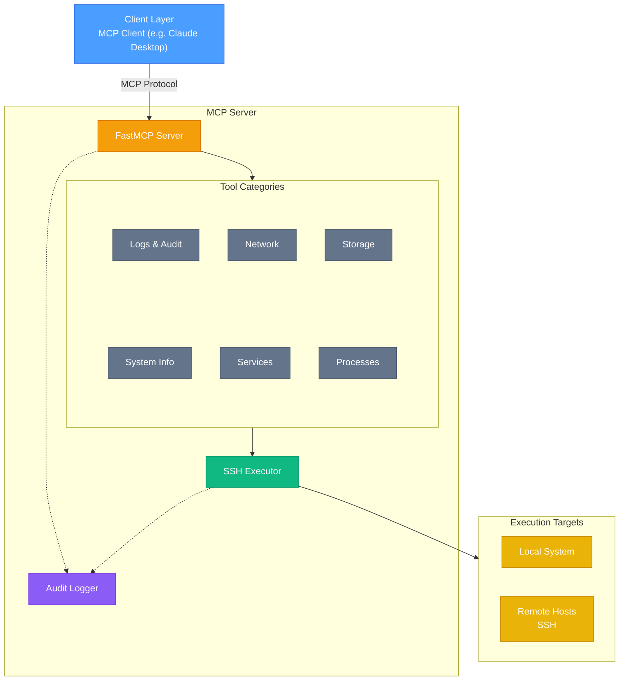

[](https://github.com/rhel-lightspeed/linux-mcp-server/actions/workflows/ci.yml)
[](https://codecov.io/gh/rhel-lightspeed/linux-mcp-server)


# Linux MCP Server

A Model Context Protocol (MCP) server for read-only Linux system administration, diagnostics, and troubleshooting on RHEL-based systems.

## Features

- **Read-Only Operations**: All tools are strictly read-only for safe diagnostics
- **Remote SSH Execution**: Execute commands on remote systems via SSH with key-based authentication
- **Multi-Host Management**: Connect to different remote hosts in the same session
- **Comprehensive Diagnostics**: System info, services, processes, logs, network, and storage
- **Configurable Log Access**: Control which log files can be accessed via environment variables
- **RHEL/systemd Focused**: Optimized for Red Hat Enterprise Linux systems

## Architecture Overview



### Key Components

- **FastMCP Server**: Core MCP protocol server handling tool registration and invocation
- **Tool Categories**: Six categories of read-only diagnostic tools (system info, services, processes, logs, network, storage)
- **SSH Executor**: Routes commands to local subprocess or remote SSH execution with connection pooling
- **Audit Logger**: Comprehensive logging in both human-readable and JSON formats with automatic rotation
- **Multi-Target Execution**: Single server instance can execute commands on local system or multiple remote hosts

## Available Tools

### System Information
- `get_system_info` - OS version, kernel, hostname, uptime
- `get_cpu_info` - CPU details and load averages
- `get_memory_info` - RAM usage and swap details
- `get_disk_usage` - Filesystem usage and mount points
- `get_hardware_info` - Hardware details (CPU architecture, PCI/USB devices, memory hardware)

### Service Management
- `list_services` - List all systemd services with status
- `get_service_status` - Detailed status of a specific service
- `get_service_logs` - Recent logs for a specific service

### Process Management
- `list_processes` - Running processes with CPU/memory usage
- `get_process_info` - Detailed information about a specific process

### Logs & Audit
- `get_journal_logs` - Query systemd journal with filters
- `get_audit_logs` - Read audit logs (if available)
- `read_log_file` - Read specific log file (whitelist-controlled)

### Network Diagnostics
- `get_network_interfaces` - Network interface information
- `get_network_connections` - Active network connections
- `get_listening_ports` - Ports listening on the system

### Storage & Disk Analysis
- `list_block_devices` - Block devices and partitions
- `list_directories_by_size` - List directories sorted by size (largest first) with top N limit
- `list_directories_by_name` - List all directories sorted alphabetically (A-Z or Z-A)
- `list_directories_by_modified_date` - List all directories sorted by modification date (newest/oldest first)

## Installation

### Quick Start

Install from PyPI:
```bash
pip install linux-mcp-server
```

Or run without installation using `uvx`:
```bash
uvx linux-mcp-server
```

### For Developers

Clone and set up for development:
```bash
git clone https://github.com/rhel-lightspeed/linux-mcp-server.git
cd linux-mcp-server
uv venv
source .venv/bin/activate
uv sync --group dev
```

### Complete Installation Guide

For detailed installation instructions including:
- Platform-specific setup (Linux, macOS, Windows)
- AI Agent integrations
- Development environment setup
- Troubleshooting

See **[INSTALL.md](INSTALL.md)**

## Configuration

Key environment variables:
- `LINUX_MCP_ALLOWED_LOG_PATHS` - Comma-separated list of log files that can be accessed
- `LINUX_MCP_LOG_LEVEL` - Logging level (DEBUG, INFO, WARNING, ERROR, CRITICAL)
- `LINUX_MCP_SSH_KEY_PATH` - Path to SSH private key for remote execution

For complete configuration details, see **[INSTALL.md - Environment Variables](INSTALL.md#environment-variables)**.

### Audit Logging

All server operations are logged in both human-readable and JSON formats with automatic daily rotation and configurable retention. Logs are stored in `~/.local/share/linux-mcp-server/logs/`.

### Remote SSH Execution

All tools support optional `host` and `username` parameters for remote execution via SSH:

- **Authentication**: SSH key-based authentication only (no password support)
- **Key Discovery**: Automatically discovers SSH keys from `~/.ssh/` or use `LINUX_MCP_SSH_KEY_PATH`
- **Connection Pooling**: Reuses SSH connections for efficiency
- **Multi-Host**: Each tool call can target a different remote host

**Requirements**:
- SSH key-based authentication must be configured on remote hosts
- Remote user must have appropriate permissions for diagnostic commands

## Usage

### Running the Server

After installation, run the server:

```bash
linux-mcp-server
```

For detailed usage instructions, available tools, and example troubleshooting sessions, see **[USAGE.md](USAGE.md)**.

### Using with Claude Desktop

For complete Claude Desktop integration instructions including platform-specific config file locations and alternative configurations, see **[INSTALL.md - Claude Desktop Integration](INSTALL.md#claude-desktop-integration)**.

## Development

For developers who want to contribute or modify the code:

**Setup:**
```bash
git clone https://github.com/rhel-lightspeed/linux-mcp-server.git
cd linux-mcp-server
uv venv
source .venv/bin/activate
uv sync --group dev
pytest
```

For complete development workflow, coding standards, and contribution guidelines, see **[CONTRIBUTING.md](CONTRIBUTING.md)**.

## Security Considerations

- All operations are **read-only**
- Log file access is controlled via whitelist (`LINUX_MCP_ALLOWED_LOG_PATHS`)
- **SSH key-based authentication only** - no password support
- SSH host key verification is disabled for flexibility (use with caution)
- No arbitrary command execution
- Input validation on all parameters
- Requires appropriate system permissions for diagnostics
- Remote user needs proper sudo/permissions for privileged commands
