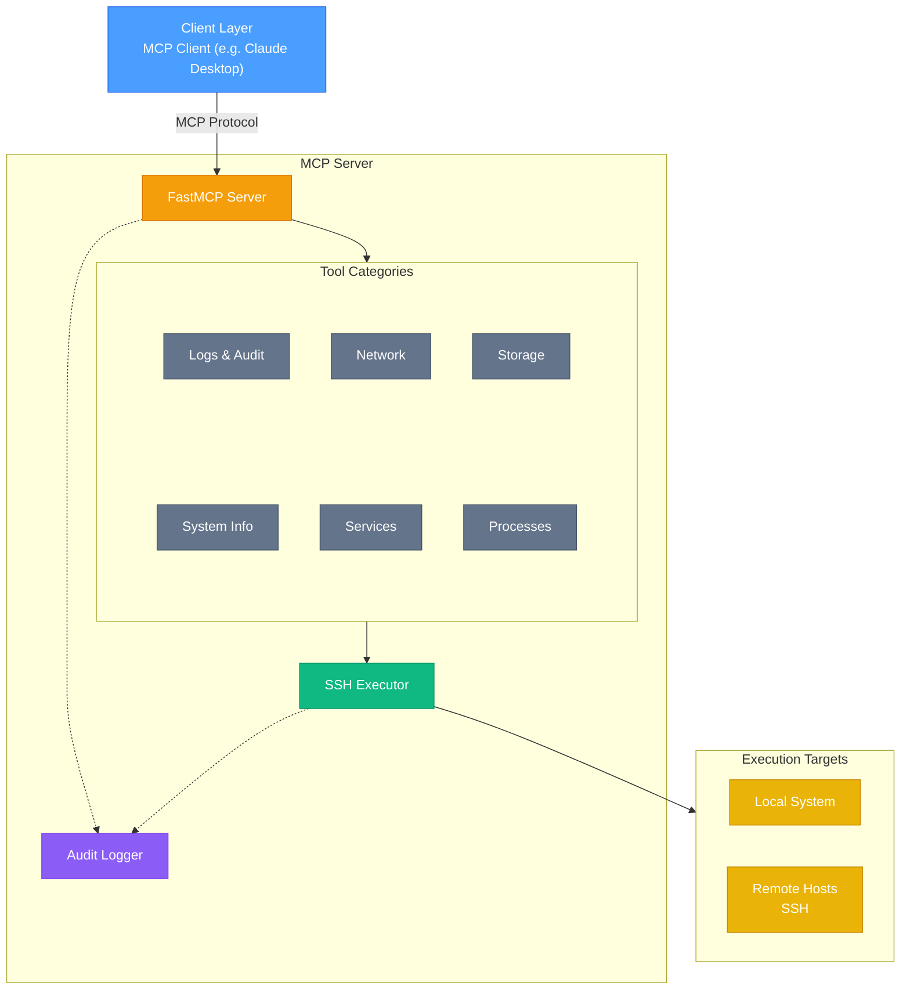

## Architecture Overview

```mermaid
graph TB
    Client["Client Layer<br/>MCP Client (e.g. Claude Desktop)"]

    subgraph Server["MCP Server"]
        FastMCP[FastMCP Server]

        subgraph Tools["Tool Categories"]
            direction LR
            subgraph Row1[" "]
                SystemInfo[System Info]
                Services[Services]
                Processes[Processes]
            end
            subgraph Row2[" "]
            Logs[Logs & Audit]
                Network[Network]
                Storage[Storage]
            end
        end

        Executor[SSH Executor]
        Logger[Audit Logger]
    end

    subgraph Targets["Execution Targets"]
        direction LR
        Local[Local System]
        Remote[Remote Hosts<br/>SSH]
    end

    Client -->|MCP Protocol| FastMCP
    FastMCP --> Tools
    Tools --> Executor
    Executor --> Targets

    FastMCP -.-> Logger
    Executor -.-> Logger

    style Client fill:#4a9eff,stroke:#2563eb,color:#fff
    style FastMCP fill:#f59e0b,stroke:#d97706,color:#fff
    style SystemInfo fill:#64748b,stroke:#475569,color:#fff
    style Services fill:#64748b,stroke:#475569,color:#fff
    style Processes fill:#64748b,stroke:#475569,color:#fff
    style Logs fill:#64748b,stroke:#475569,color:#fff
    style Network fill:#64748b,stroke:#475569,color:#fff
    style Storage fill:#64748b,stroke:#475569,color:#fff
    style Executor fill:#10b981,stroke:#059669,color:#fff
    style Logger fill:#8b5cf6,stroke:#7c3aed,color:#fff
    style Local fill:#eab308,stroke:#ca8a04,color:#fff
    style Remote fill:#eab308,stroke:#ca8a04,color:#fff
    style Row1 fill:none,stroke:none
    style Row2 fill:none,stroke:none
```
