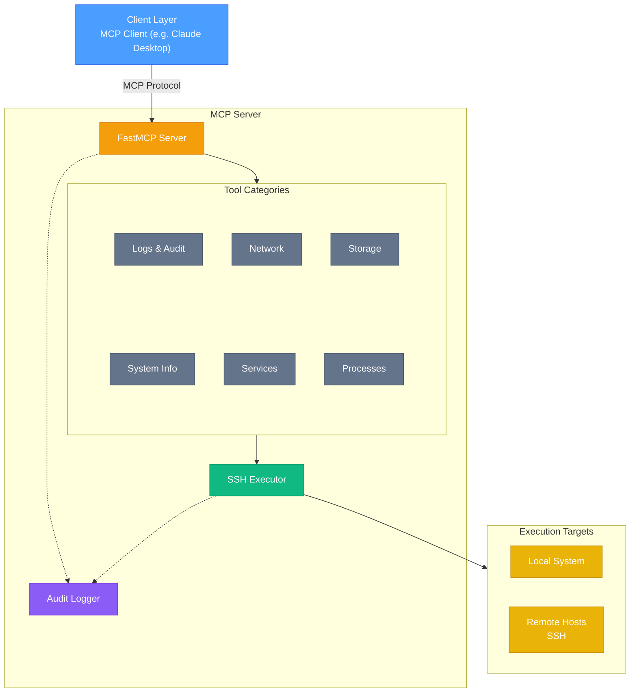
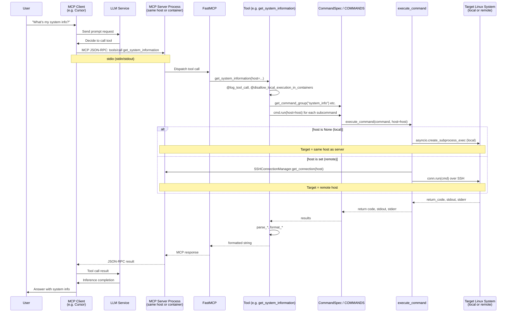

## Architecture Overview

## Where Each Component Runs

Understanding where the **client**, **MCP server**, and **target Linux system** run is helpful for deployment and development alike.

| Component | Location | Description |
|-----------|----------|-------------|
| **Client** | User's machine | The MCP client (Cursor, Claude Desktop, Goose, etc.) runs on the machine where the user works. It spawns the Linux MCP Server as a **subprocess** and communicates over **stdio** (stdin/stdout) using the MCP protocol (JSON-RPC). |
| **MCP Server** | Same host as client, or in a container | The server process is started by the client (e.g. `linux-mcp-server` or `podman run ... linux-mcp-server`). With a native install it runs on the **same machine as the client**. With a container deploy it runs **inside the container** on that same machine. In both cases the server receives tool calls over stdio and performs command execution. |
| **Target Linux system** | Same host as client, or any host reachable via SSH | Commands are executed either **locally** on the same host where the MCP server is running (subprocess or container), or **remotely** on another machine. Remote execution is done by the server opening an **SSH connection from the server host to the target host** and running commands there. The client never talks to the target directly. |

This means:

- **Client ↔ Server**: Communication is **always** over stdio, using the MCP JSON-RPC protocol. The client does not connect to the target directly.
- **Server ↔ Target**: If `host` is omitted, execution is **local** (same host as the server). If `host` is set, the server **SSHs from its own host** to that host to run commands.
- **Containers**: When the server runs in a container, “local” means inside the container. Local execution can be disabled via the `disallow_local_execution_in_containers` decorator (tools then require a `host` parameter for remote SSH).

## Detailed Tool Call Flow

End-to-end flow of a single MCP tool call: from the client request through the server to command execution on the target, and back.

1. User asks a question in the MCP client (e.g. Cursor).
2. Client sends the prompt to the LLM; the LLM decides to call a tool.
3. Client sends MCP JSON-RPC `tools/call` (e.g. `get_system_information`) over **stdio** to the MCP server (same host or container).
4. FastMCP dispatches the call to the tool.
5. Tool runs decorators (`@log_tool_call`, `@disallow_local_execution_in_containers`), resolves commands via `CommandSpec`/`COMMANDS`, and invokes `cmd.run(host=host)` for each subcommand.
6. `execute_command` runs on the target: **local** (`asyncio.create_subprocess_exec` when `host` is omitted) or **remote** (SSH via `SSHConnectionManager` when `host` is set).
7. Target returns return code, stdout, and stderr to `execute_command`.
8. Results flow back: Exec → Cmd → Tool; tool parses and formats (e.g. `parse_*`, `format_*`).
9. Tool returns formatted string to FastMCP; server sends MCP response over stdio to the client.
10. Client passes the tool result to the LLM; LLM produces the answer; client presents it to the user.

