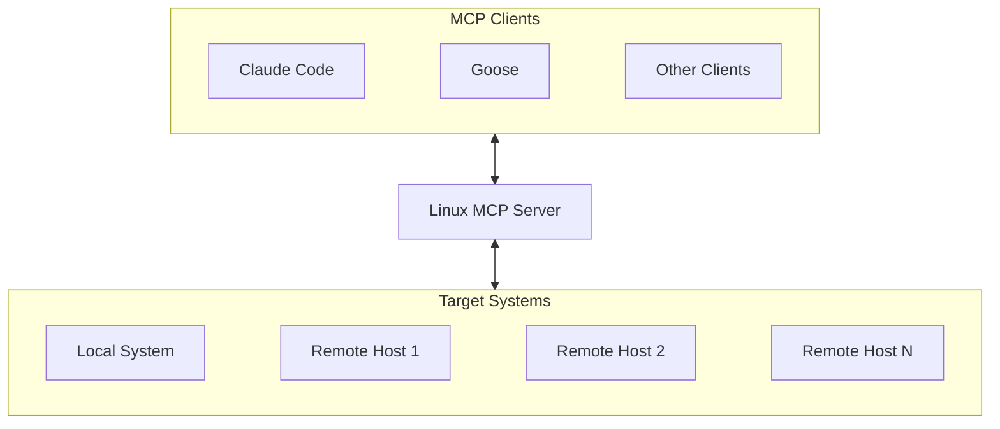

# Linux MCP Server

[](https://github.com/rhel-lightspeed/linux-mcp-server/actions/workflows/ci.yml)
[](https://codecov.io/gh/rhel-lightspeed/linux-mcp-server)
[](https://pypi.org/project/linux-mcp-server)

A Model Context Protocol (MCP) server for read-only Linux system administration, diagnostics, and troubleshooting on Linux systems.

## 🚀 New to MCP?

**[Start Here: Getting Started Guide](getting-started.md)**  
Learn what MCP is, how to set it up, and run your first command in 5 minutes.

## ⚡ Quick Reference

**[Cheatsheet](cheatsheet.md)**  
A fast lookup guide for common tasks and tools.

## Quick Start

1. Install via pip
```bash
pip install --user linux-mcp-server
```

2. [Configure your favorite MCP client](clients.md)

3. Start diagnosing Linux systems!

See the [Installation Guide](install.md) for container installs, SSH setup, and more.

## How It Works



## Features

- 🔒 **Read-Only Operations**: All tools are strictly read-only—diagnose with confidence knowing nothing will be modified. Perfect for production systems where you need answers without risk.

- 🌐 **Remote SSH Execution**: Troubleshoot remote servers from your local machine using secure SSH key-based authentication. No need to hop between terminals or remember complex command syntax.

- 🖥️ **Multi-Host Management**: Connect to your home lab, cloud VMs, or an entire data center in a single session. Seamlessly switch between hosts without reconfiguring.

- 🔍 **Comprehensive Diagnostics**: Get the full picture—system info, services, processes, logs, network connections, and storage—all through natural language queries. Ask "why is my system slow?" instead of memorizing `ps`, `journalctl`, and `ss` flags.

- 📋 **Configurable Log Access**: Control exactly which log files can be accessed via environment variables. Enterprise teams can enforce security policies while still enabling effective troubleshooting.

- 🎯 **RHEL/systemd Focused**: Built for Red Hat Enterprise Linux, Fedora, CentOS Stream, and other systemd-based distributions. Whether you're managing a personal Fedora workstation or a fleet of RHEL servers, this tool speaks your system's language.

## Key Components

- **FastMCP Server**: Core MCP protocol server handling tool registration and invocation
- **Tool Categories**: Six categories of read-only diagnostic tools
- **SSH Executor**: Routes commands to local subprocess or remote SSH execution with connection pooling
- **Audit Logger**: Comprehensive logging in both human-readable and JSON formats with automatic rotation
- **Multi-Target Execution**: Single server instance can execute commands on local system or multiple remote hosts
