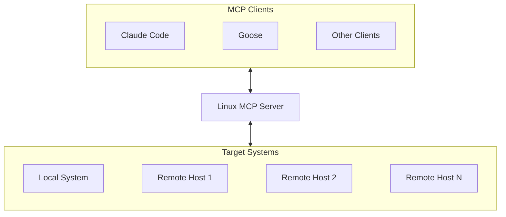

# Linux MCP Server

[](https://github.com/rhel-lightspeed/linux-mcp-server/actions/workflows/ci.yml)
[](https://codecov.io/gh/rhel-lightspeed/linux-mcp-server)
[](https://pypi.org/project/linux-mcp-server)

A Model Context Protocol (MCP) server for read-only Linux system administration, diagnostics, and troubleshooting on Linux systems.

## Quick Start

1. Install [uv](https://docs.astral.sh/uv/getting-started/installation/), then install the server:

    ```bash
    uv tool install linux-mcp-server
    ```

1. Make sure [SSH connectivity is properly configured](ssh.md) between the system running the Linux MCP Server and the remote hosts you want to inspect.

1. [Configure your favorite MCP client](clients.md)

    Here is an example configuration for Claude Desktop. Make sure to replace `YOUR_USER` with your actual username.

    ```json
    {
      "mcpServers": {
        "Linux Tools": {
          "command": "/home/YOUR_USER/.local/bin/linux-mcp-server",
          "env": {
            "LINUX_MCP_ALLOWED_LOG_PATHS": "/var/log/messages,/var/log/lastlog"
          }
        }
      }
    }
    ```

1. Start diagnosing Linux systems!

For other installation methods, see the [Installation Guide](install.md).


## How It Works


```mermaid
flowchart TB
    subgraph clients["MCP Clients"]
        direction LR
        C1[Claude Code] ~~~ C2[Goose] ~~~ C3[Other Clients]
    end

    MCP[Linux MCP Server]

    subgraph targets["Target Systems"]
        direction LR
        L[Local System] ~~~ R1[Remote Host 1] ~~~ R2[Remote Host 2] ~~~ RN[Remote Host N]
    end

    clients <--> MCP
    MCP <--> targets
```

## Features

- **Read-Only Operations**: All tools are strictly read-only -- diagnose with confidence knowing nothing will be modified. Perfect for production systems where you need answers without risk.

- **Remote SSH Execution**: Troubleshoot remote servers from your local machine using secure SSH key-based authentication. No need to hop between terminals or remember complex command syntax.

- **Multi-Host Management**: Connect to your home lab, cloud VMs, or an entire data center in a single session. Seamlessly switch between hosts without reconfiguring.

- **Comprehensive Diagnostics**: Get the full picture -- system info, services, processes, logs, network connections, and storage -- all through natural language queries. Ask "why is my system slow?" instead of memorizing `ps`, `journalctl`, and `ss` flags.

- **Configurable Log Access**: Control exactly which log files can be accessed via environment variables. Enterprise teams can enforce security policies while still enabling effective troubleshooting.

- **RHEL/systemd Focused**: Built for Red Hat Enterprise Linux, Fedora, CentOS Stream, and other systemd-based distributions. Whether you're managing a personal Fedora workstation or a fleet of RHEL servers, this tool speaks your system's language.
