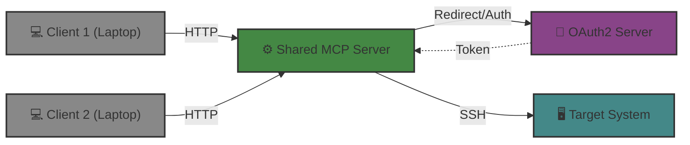

# Shared Server

## Introduction

The most basic way of running linux-mcp-server is to run it right on the sysadmin's system,
together with the LLM client. When used in this way,
linux-mcp-server can directly access the sysadmin's SSH credentials and act on their behalf.

However, it is also possible to install linux-mcp-server centrally
so that a single server is shared by multiple users.



Benefits of setting up linux-mcp-server this way include:

 - Once the server is set up, minimal configuration is needed to use it from a client.
 - Policies and configuration can be centrally managed and configured
 - Access is centrally logged.

But it's important to note that in this configuration the target systems are being accessed
with credentials *that belong to the MCP server rather than to the user*.
This means that if access to linux-mcp-server is not properly controlled,
users could get access to target systems that they aren't intended to have.

Controlling access requires configuring several additional items:

We need an *Authorization Server*.
linux-mcp-server redirects the LLM client to the Authorization Server,
allowing the user to authenticate themselves.
Authorization server examples include Keycloak, Okta, Ping, and Microsoft Entra ID.
The authorization server then issues an authorization (OAuth2) token;
this can be "decoded" by the MCP server to get a bunch of fields called *claims*.
Here's an example.

```yaml
{
  # These claims are used by the MCP server when checking validity
  "iss": "https://auth.example.com",
  "aud": "client_app_98765",
  "exp": 1800000000,
  "iat": 1780000000,
  # A unique user ID for the user
  "sub": "user_87439201aBc",
  # email address
  "email": "jane.doe@example.com",
  "email_verified": true,
  # rhel-mcp-server:readonly is a custom scope
  "scope": "openid profile email rhel-mcp-server:readonly"
  # You can have custom claims as well - this is a common way to represent group membership
  "groups": ["staff", "app-rhel-mcp-server-users"]
}
```

Most claims represent the user's *identity*. The `scope` claim represents resources
that the MCP server is allowed to access on behalf of the user.

And we need a *Authorization Policy*.
The authorization policy uses the issued token to determine what hosts can be accessed by the
client and what tools it can use on those hosts.

The authorization policy has a list of rules that match the users identity or granted
scope and say what hosts they can access and what tools they can use on those hosts.
The policy also controls how the host can be accessed.

## Running linux-mcp-server as a shared server

linux-mcp-server is a very standard Python server. It doesn't care strongly about the deployment environment, so many deployment configurations are possible - whether in Kubernetes or running directly on a VM.

 * **Installation** - it is recommended to use the official container build: `quay.io/redhat-services-prod/rhel-lightspeed-tenant/linux-mcp-server:latest`.
 * **Transport** - `LINUX_MCP_TRANSPORT` should be set to http.
 * **TLS** - currently linux-mcp-server does not support TLS; it is necessary to run a frontend server such as NGINX in front of linux-mcp-server to provide TLS termination.
 * **Logging** - you should use a log forwarder to forward logs from the configured `LINUX_MCP_LOG_DIR` to your central log collector.
 * **Clustering and resilience** - when using the `@fixed` toolset, linux-mcp-server is stateless. You can run multiple servers and restart them at any time. However, currently the `@run_script` toolset maintains state in the running server. Load-balancing between running servers will cause misbehavior, and server restarts may break active client sessions.

## Configuring clients to access a shared server

Details of how to configure clients to access the shared linux-mcp-server instance will depend on the client.
Typically it will be as simple as adding a MCP server to the client's UI and providing the URL to the linux-mcp-server instance.
Authentication will occur interactively using OAuth2.

## Configuring the Authorization Server

Setting up and configuring an authorization server is largely outside the scope of this document.
If you don't already have one configured for your organization
or need to set up a dedicated authorization server for testing,
[Keycloak](https://www.keycloak.org) is a flexible open-source choice.
See the [Keycloak Configuration](keycloak.md) guide for step-by-step setup instructions.

When configuring an authorization server,
we need to configure a provider and set specific fields for that provider.
There are four different providers available for linux-mcp-server.
Two of them: `jwt` and `introspection` are generic and can work with many different providers.
You'll want to use one of these in production.
The differences between the two is how OAuth2 tokens are validated and decoded.
For the `jwt` provider, the token must be a [JWT](https://en.wikipedia.org/wiki/JSON_Web_Token),
and is decoded and validated locally.
For the `introspection` provider,
the token is sent back to the authorization server to validate and decode.
Your authorization server may support both methods, or only one of them.

The other two: `google` and `github` are proxies that allow a user to identify themselves with a Google or GitHub account.
If you want to to test configuring linux-mcp-server as a central server using HTTP,
you could, for example, set it up so that it could only be accessed by a particular GitHub profile.

The authorization server is configured by setting environment variables that set the provider and the details that the provider needs.
For example:

```sh
LINUX_MCP_AUTH__PROVIDER=jwt
LINUX_MCP_AUTH__JWT__JWKS_URI=https://auth.example.com/.well-known/jwks.json
LINUX_MCP_AUTH__JWT__ISSUER=https://auth.example.com
LINUX_MCP_AUTH__JWT__AUDIENCE=example-audience
```

See [Authorization Providers](config-reference.md#authorization-providers) for details about each provider.

## Configuring the Authorization policy

Unlike other configuration of linux-mcp-server,
which is done by setting environment variables,
the authorization policy is configured with a YAML file.
If you are running linux-mcp-server in Kubernetes,
this would typically be mounted into the server as a configmap.
linux-mcp-server is then pointed to that file using the `LINUX_MCP_POLICY_PATH` environment variable.

The authorization policy is a list of rules. The first matching rule is used.
If no matching rule is found, tool execution is denied.

Example 1: matching on a custom scope.

``` yaml
rules:
  - claims:
        # Custom scope granted by authorization server policy
        scp: rhel-mcp-server:readonly
    host: "*"
    # All fixed tools except the "read_file" tools are allowed
    tools: ["@fixed", "-read_file"]
    action: ssh_default
```

Example 2:

``` yaml
rules:
  # A broad group of users has read-only access
  - claims:
         # This matches if app-rhel-mcp-server-users is part of the groups list
         groups: app-rhel-mcp-server-users
    host: "*"
    tools: ["@fixed"]
    action: ssh_key
    ssh_key:
         path: /etc/linux-mcp-server/secret/rhel_mcp_readonly_ed25519
         user: rhel-mcp-users
  # Let some users have read-write access to staging servers
  - claims:
         groups: app-rhel-mcp-server-developer
    host: "*.stage.example.com"
    tools: ["@run_script"]
    action: ssh_key
    ssh_key:
         path: /etc/linux-mcp-server/secret/rhel_mcp_developer_ed25519
         user: rhel-mcp-developers
```

See [Authorization Policy](config-reference.md#authorization-policy) for details of the authorization policy yaml file.

## Using service accounts on target systems

Because the MCP server is acting on behalf of multiple users,
the SSH keys that you configure for it should be belong to service accounts.
Depending on your setup, you might:

 * Configure the service account users globally via LDAP or similar.
 * Establish the service account users and their `~/.ssh/authorized_keys` using a configuration managemenet system like Ansible.

For the default `@fixed` toolset, the service account user should not have root access,
but should have access to whatever resources are needed for investigation.
For example, you may want to add the service account to the `systemd-journal` group so it has access to systemd logs.

For [Guarded Command Execution](guarded-command-execution.md) with the `@run_script` toolset,
the service account will need to be able to sudo to root without a password.
***Use caution*** -
the guard rails in linux-mcp-server are meant to help prevent prompt injection and other forms of unauthorized
and unintended commands, but they cannot be perfect,
and *are not* meant to constrain what an authorized user can do.
Granting such wide access is more suitable for a development system than a production environment.

## Configuring clients to access a shared server

Details of how to configure clients to access the shared linux-mcp-server instance will depend on the client.
Typically it will be as simple as adding a MCP server to the client's UI and providing the URL to the linux-mcp-server instance.
Authentication will occur interactively using OAuth2.
